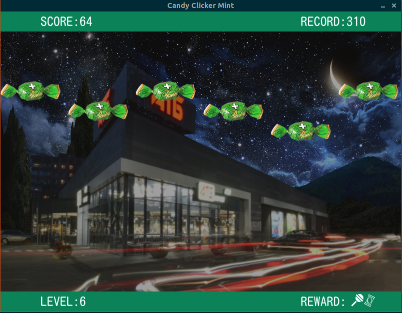

# Candy Mint Clicker

I have written a simple and uncomplicated clicker game to enjoy over the weekend. 
The goal of the game is straightforward - click on the candies to earn rewards.

## Game installation instructions

_All commands are executed in the terminal_

1. Make sure that you have Python version 3.10 (recommended) or higher [installed](https://realpython.com/installing-python/) on your computer.
2. Create a folder `{your_folder}`, come to this folder
3. Clone the repository to your computer: `git clone {url_repository} `.
4. Go to repository folder `cd {folder_repository}`
5. Create a virtual environment: `python3.10 -m venv venv`
6. Activate environment `source venv/bin/activate`
7. Install the required: `pip install -r requirements.txt`.
8. If you need to update pip: `pip install --upgrade pip`
9. Navigate to the "game" `cd game`.
10. Run the "main.py" file by executing the following command: `python3.10 main.py`.

_enjoy the game_

## Future plans

There is a desire to implement a system of lives.

P.S.
In fact, there are many lessons and tasks at the university, so I can't fully invest in the game.

But the project is not closed!